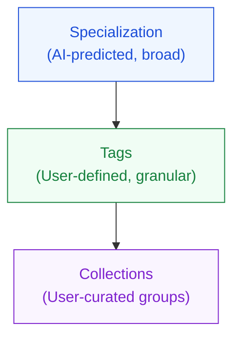
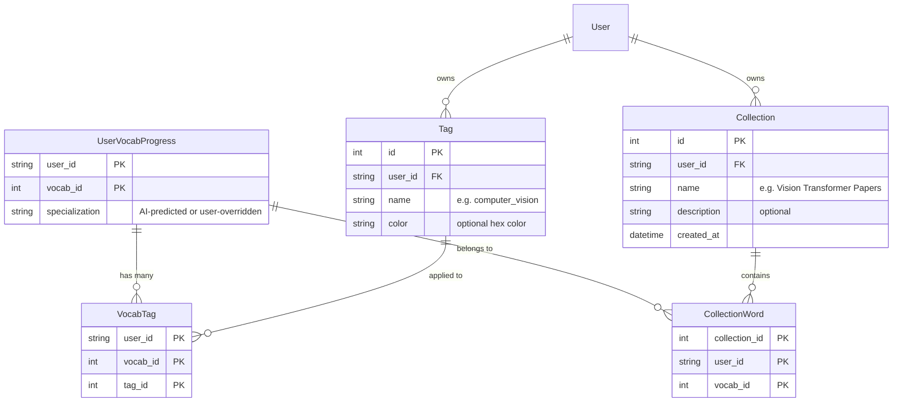

# 🏷️ Thiết kế: User Tags & Collections cho Vocabulary

## 1. Vấn đề hiện tại

Hệ thống hiện tại dùng **1 trường duy nhất** `specialization` trên `UserVocabProgress`:

```
specialization = Column(String(100), nullable=True)
# Giá trị: "ai_computer_science", "economics_business", ...
```

**Hạn chế:**
- **Quá rộng**: Tất cả từ về AI/CS đều gom vào `ai_computer_science` — không phân biệt được NLP vs Computer Vision vs LLM
- **AI quyết định, user bị động**: Nếu AI predict sai specialization, user không sửa được
- **Không thể nhóm theo ngữ cảnh cá nhân**: User đọc paper về "Transformer for Medical Imaging" — từ `attention` thuộc AI hay Medicine?
- **1 từ chỉ có 1 specialization**: Thực tế nhiều thuật ngữ thuộc nhiều lĩnh vực

---

## 2. Mô hình đề xuất: 3 tầng phân loại



| Layer | Ai tạo? | Granularity | Ví dụ | Mục đích |
|---|---|---|---|---|
| **Specialization** | AI (user có thể override) | Broad (7 categories) | `ai_computer_science` | Phân loại tự động, filter nhanh |
| **Tags** | User tạo tự do | Granular | `computer_vision`, `LLM`, `transformer` | Gắn nhãn chi tiết theo chủ đề con |
| **Collections** | User tạo tự do | Tùy ý | "Paper: Attention Is All You Need", "Midterm Vocab" | Gom từ theo mục đích cá nhân |

### Sự khác biệt giữa Tag và Collection:

| | Tags | Collections |
|---|---|---|
| **Tính chất** | Label gắn vào từ | Thư mục/playlist chứa từ |
| **Số lượng** | 1 từ có nhiều tags | 1 từ có thể nằm trong nhiều collections |
| **Tạo bởi** | User nhập tự do (có auto-suggest) | User tạo rõ ràng (có tên + mô tả) |
| **Ví dụ** | `#computer_vision`, `#LLM`, `#NLP` | "Chương 3: Neural Networks", "IELTS Academic" |
| **Use case** | Filter nhanh, tìm kiếm | Ôn tập theo bộ, chia sẻ |

---

## 3. Ví dụ thực tế: User đọc paper về Vision Transformer

User đọc bài "An Image is Worth 16x16 Words: Transformers for Visual Recognition":

```
Từ: "patch embedding"
├── Specialization: ai_computer_science    (AI-predicted ✅)
├── Tags: #computer_vision, #transformer   (User gắn)
└── Collections: 
    ├── "Vision Transformer Papers"        (User tạo)
    └── "Midterm AI Review"                (User tạo)
```

```
Từ: "self-attention"
├── Specialization: ai_computer_science    (AI-predicted ✅)
├── Tags: #transformer, #LLM, #NLP        (User gắn)
└── Collections:
    ├── "Vision Transformer Papers"
    ├── "NLP Fundamentals"
    └── "Midterm AI Review"
```

```
Từ: "inductive bias"
├── Specialization: math_data_science      (AI predicted ❌ → User override → ai_computer_science)
├── Tags: #deep_learning, #theory
└── Collections: "Vision Transformer Papers"
```

---

## 4. Database Schema

### Bảng mới cần tạo:



### Thay đổi cụ thể:

**Giữ nguyên** `UserVocabProgress.specialization` — nhưng cho phép user override.

**Thêm 4 bảng mới:**

```python
class Tag(Base):
    __tablename__ = "tags"
    id = Column(Integer, primary_key=True, index=True)
    user_id = Column(String(36), ForeignKey("users.user_id"), nullable=False)
    name = Column(String(100), nullable=False)       # "computer_vision"
    color = Column(String(7), nullable=True)          # "#3b82f6"
    # Unique constraint: mỗi user không có 2 tag trùng tên
    # UniqueConstraint("user_id", "name")

class VocabTag(Base):
    __tablename__ = "vocab_tags"
    user_id = Column(String(36), primary_key=True)
    vocab_id = Column(Integer, ForeignKey("vocabularies.id"), primary_key=True)
    tag_id = Column(Integer, ForeignKey("tags.id"), primary_key=True)

class Collection(Base):
    __tablename__ = "collections"
    id = Column(Integer, primary_key=True, index=True)
    user_id = Column(String(36), ForeignKey("users.user_id"), nullable=False)
    name = Column(String(255), nullable=False)
    description = Column(String(500), nullable=True)
    created_at = Column(DateTime, default=datetime.datetime.utcnow)

class CollectionWord(Base):
    __tablename__ = "collection_words"
    collection_id = Column(Integer, ForeignKey("collections.id"), primary_key=True)
    user_id = Column(String(36), primary_key=True)
    vocab_id = Column(Integer, ForeignKey("vocabularies.id"), primary_key=True)
```

---

## 5. API Endpoints

### 5.1 Specialization Override

```
PUT /api/vocab/{word}/specialization
Body: { "specialization": "ai_computer_science" }
```

Đơn giản nhất — chỉ update 1 field trên `UserVocabProgress`.

### 5.2 Tag Management

```
GET    /api/tags                          → Lấy tất cả tags của user
POST   /api/tags                          → Tạo tag mới { name, color }
DELETE /api/tags/{tag_id}                  → Xóa tag

POST   /api/vocab/{word}/tags             → Gắn tags cho từ { tag_ids: [1, 2] }
DELETE /api/vocab/{word}/tags/{tag_id}     → Bỏ tag khỏi từ
GET    /api/vocab/{word}/tags             → Lấy tags của 1 từ
```

### 5.3 Collection Management

```
GET    /api/collections                    → Lấy tất cả collections
POST   /api/collections                    → Tạo collection { name, description }
PUT    /api/collections/{id}               → Sửa collection
DELETE /api/collections/{id}               → Xóa collection

POST   /api/collections/{id}/words         → Thêm từ vào collection { words: ["attention", "embedding"] }
DELETE /api/collections/{id}/words/{word}   → Bỏ từ khỏi collection
GET    /api/collections/{id}/words         → Lấy từ trong collection
```

### 5.4 Tích hợp Practice

```
GET /api/vocab/practice?specialization=ai_computer_science&tag=LLM
GET /api/vocab/practice?collection_id=5
GET /api/vocab/quiz?tag=computer_vision&quiz_type=en_to_vi
```

---

## 6. Frontend UX Flow

### 6.1 Trên Vocab List Page — Inline Tag/Collection Editor

```
┌─────────────────────────────────────────────────────┐
│  attention                                    [Edit]│
│  Cơ chế chú ý (Attention mechanism)                 │
│                                                     │
│  ⬡ ai_computer_science  [Change ▾]                  │
│  🏷️ #transformer  #NLP  #LLM  [+ Add tag]          │
│  📁 NLP Fundamentals, Midterm Review  [+ Add]       │
└─────────────────────────────────────────────────────┘
```

### 6.2 Trên Practice Config Screen — Filter mở rộng

```
┌─ Choose what to practice ──────────────────────────┐
│                                                     │
│  ⬡ Specialization    [All ▾]                        │
│  🏷️ Tags             [#LLM] [#transformer] [×]      │
│  📁 Collection        [Vision Transformer Papers ▾] │
│                                                     │
│  → 12 words match your filters                      │
└─────────────────────────────────────────────────────┘
```

### 6.3 Trên Flashcard — Quick Tag

Trên mặt trước flashcard, hiện tag badges + nút "+" để gắn tag nhanh mà không cần rời practice.

---

## 7. Recommendation: Phân giai đoạn

> [!IMPORTANT]
> **Gợi ý triển khai theo 2 giai đoạn:**

### Giai đoạn A — Tag System (nên làm trước)
1. ✅ Override specialization (rất nhỏ, chỉ 1 API)
2. ✅ CRUD Tags + gắn tag cho từ
3. ✅ Filter practice/quiz theo tag
4. ✅ Hiện tags trên Vocab List + Flashcard

**Lý do**: Tags là tính năng có giá trị nhất — cho phép phân loại granular mà không cần cấu trúc phức tạp. Đây cũng là điểm **unique** so với các app flashcard khác (Anki, Quizlet không có AI-predicted specialization + user tags).

### Giai đoạn B — Collection System (nếu có thời gian)
1. CRUD Collections
2. Thêm/bỏ từ vào collection
3. Practice theo collection
4. Dashboard hiện collection stats

**Lý do**: Collection hữu ích nhưng phức tạp hơn (cần UI quản lý riêng, drag-and-drop, etc.) và có thể trì hoãn.

> [!TIP]
> **Điểm nhấn cho đề tài**: Hệ thống 3 tầng (AI Specialization → User Tags → Collections) thể hiện sự kết hợp giữa **AI tự động** và **human-in-the-loop** — rất phù hợp để viết vào báo cáo đề tài dưới dạng "Hybrid AI-User taxonomy for specialized terminology management".